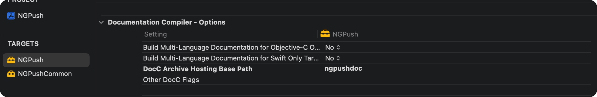
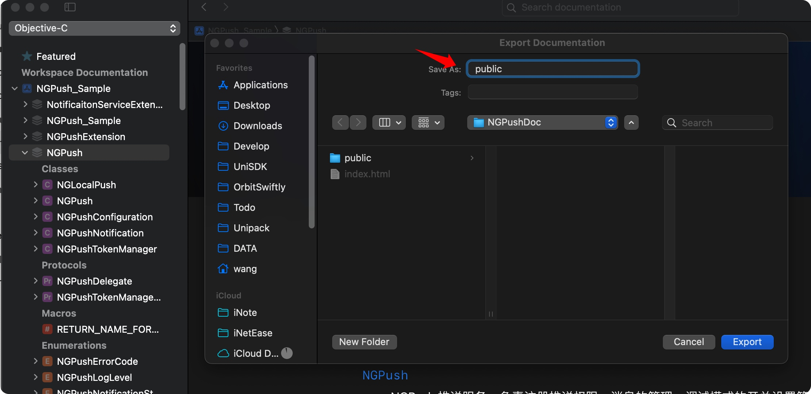

# DocC

Swift-DocC 支持将 Swift 代码中的注释生成 API 说明文档，Xcode 14.0+ 版本增加支持了 Objective-C、C 语言。

## 注释

注释支持 Markdown 语法，需使用以下注释规范，才可正确生产 DocC 文档

### 标记

```swift
// MARK: 标示
// MARK: - 带分割线的标示

// TODO: 待实现的
// TODO: - 带分割线待实现的

// FIXME: 需要修复的
```

### 文档注释

Xcode 快捷键 ⌥ + ⌘ + / ，来为代码生成文档注释 `///`

```swift
/// 两个整数相加

/// - Important: 返回值
/// - Note: 提示
/// - Warning: 警告
/// - Version: 1.0.0
/// - Requires: 使用的方法的要求
/// - Attention: 注意
- 
/// - Authors: Gh.Wang
/// - Date: 2022-09-28
/// - Precondition: 使用方法的前置条件
/// - Postcondition：使用方法的后置条件
/// - Invariant: 不变的
/// - Experiment: 试验点新玩法
/// - Complexity: 复杂度
/// - Bug: 标记下问题
/// - TODO: 需改进的代码
/// 
/// - Parameters:
///   - a: 参数 1
///   - b: 参数 2
/// - Throws: 抛出错误
/// - Returns: 返回值
```

## 部署文档到 Gitlab Pages

1. 在 `Xcode -> Target -> Build Setting -> DocC Archive Hosting Base Path` 添加部署地址的 path 部分（URL 去除 host 的剩余部分） 。

    


2. 使用 `Xcode -> Product -> Build Documentation` 可构建生成 API 说明文档。完成后自动打开 Develop Documentation 页面预览生成的文档。
    
3. 导出文档到预发布的 Git 仓库文件夹下，并重命名为 `public`。

    

4. 在 Git 仓库根目录下创建 `.gitlab-ci.yml` 文件，并写入以下内容：

    ```yml
    # This file is a template, and might need editing before it works on your project.
    # Full project: https://gitlab.com/pages/plain-html
    pages:
      stage: deploy
      script:
        - echo "The site will be deployed to $CI_PAGES_URL"
      artifacts:
        paths:
          - public
      only:
        - master
    ```

5. 目前 DocC 生成的 `index.html` 文件在 Gitlab Pages 下重定向会失败，返回 404 错误，因此需要修改 index.html。替换为以下内容：

    ```html
    <!DOCTYPE html>
    <meta charset="utf-8">
    <meta http-equiv="refresh" content="1; url=https://<username>.github.io/<repo-name>/documentation/<target-name>">
    <script>
      window.location.href = "https://<username>.github.io/<repo-name>/documentation/<target-name>"
    </script>
    <title>Redirecting...</title>
    If you are not redirected automatically, follow
    <a href="https://<username>.github.io/<repo-name>/documentation/<target-name>">
      this link
    </a>.
    ``` 
    
    - \<username\>：Gitlab 用户名
    - \<repo-name\>：Gitlab 仓库名
    - \<target-name\>：部署文档的 Target 名

6. 提交 Git 变更，并推送到远程仓库。并在 Gitlab 部署 Pages 服务，需在 `Gitlab -> Setting -> CI/CD` 开启 Runners 申请分配 Runners，并且启用公用的 Shared Runners

7. 提交 Git 变更后会自动生成页面，等自动构建任务完成后，可以在 Pages 页面查看到生成的页面链接，并可点击测试


## 参考

- [https://www.swift.org/documentation/docc/distributing-documentation-to-other-developers](https://www.swift.org/documentation/docc/distributing-documentation-to-other-developers)

- [https://developer.apple.com/forums/thread/709748](https://developer.apple.com/forums/thread/709748)

- [Gitlab Pages文档服务接入](https://sa.nie.netease.com/docs/gitlab/运维支撑/Gitlab/06-用户手册/05-DevOps服务/gitlab-cicd指引/Pages文档服务接入.md)
